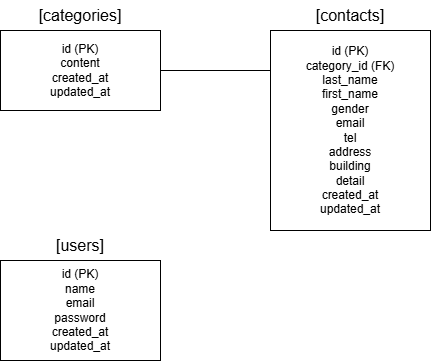

# FashionablyLate

## 環境構築

### Dockerビルド
- git clone git@github.com:git@github.com:nagaki813/contact-form-test.git
- docker-compose up -d --build

### Laravel環境構築
- docker-compose exec php bash
- composer install
- cp .env.example .env
- .envファイルの環境変数を適宜変更
- php artisan key:generate
- php artisan migrate
- php artisan db:seed

## 開発環境
- お問い合わせ画面： http://localhost/
- 管理画面： http://localhost/admin
- ユーザー登録： http://localhost/register
- ログイン： http://localhost/login
- phpMyAdmin： http://localhost:8080/

## 使用技術(実行環境)
- PHP 8.2.30
- Laravel 12.54.1
- MySQL 8.0.45
- nginx 1.29.4

## ER図

## URL
- 開発環境： http://localhost/
- phpMyAdmin： http://localhost:8080/